# CMP362 - Image Processing and Computer Vision

This is a quick summary for the image processing course, containing important notes and explanations for important parts

- [CMP362 - Image Processing and Computer Vision](#cmp362---image-processing-and-computer-vision)
- [Texture Analysis](#texture-analysis)
  - [What is a texture?](#what-is-a-texture)
  - [Texture Analysis Approaches](#texture-analysis-approaches)
  - [Structural Approach](#structural-approach)
  - [Statistical Approach](#statistical-approach)
    - [Edge Density and Direction](#edge-density-and-direction)
    - [Local Binary Pattern (LBP)](#local-binary-pattern-lbp)
    - [Gray Level Co-occurence Matrix (GLCM)](#gray-level-co-occurence-matrix-glcm)
    - [Windowing](#windowing)
    - [Law's Texture Energy Features](#laws-texture-energy-features)
      - [The Law's Algorithm](#the-laws-algorithm)
      - [1-D Law's filters](#1-d-laws-filters)
      - [2-D Law's filters](#2-d-laws-filters)
      - [9-D Pixel Feature Vector](#9-d-pixel-feature-vector)
      - [Law's process visualized](#laws-process-visualized)
# Texture Analysis

## What is a texture?
- Texture is a repeating pattern in images.
- Gives us information about spatial relationship between colors or intensities.
- Cannot be defined for a point.
- Texture consists of **texture primitives** called **texels**.
  - **Tone** is based on the pixel intensity in the texel.
  - **Structure** represents the spatial relationship between texels.

## Texture Analysis Approaches
1. Structural Approach
     - Repeating pattern in image.
2. Statistical Approach
     - Quantitative measure of the arrangement of intensities in region.

## Structural Approach
- Set of elements occuring in a repeating pattern.
  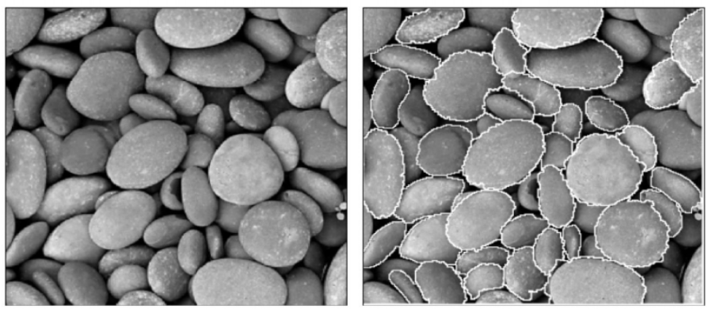
- Extracting those patterns from real images is difficult or impossible.
  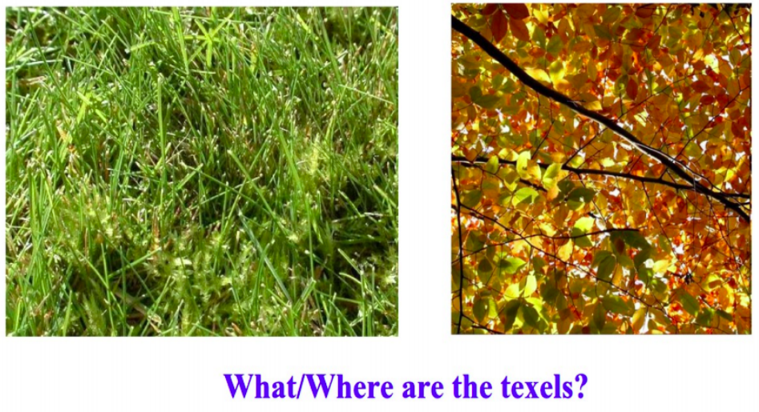

## Statistical Approach
- Numeric quantities that describe textures and can be computed from gray tones or colors alone.
- Less intuitive but **computationally efficient**.
- Can be used for **classification** or **segmentation**.

Some statistical approaches are
1. Edge density and direction
2. Local Binary Pattern (LBP)
3. Gray Level Co-occurrence Matrix (GLCM)
4. Law's Texture Energy Features

### Edge Density and Direction
- Compute the **number of edge pixels**, and **the direction of edges** in a region.
- **High edge density = busy region**.
- Edgeness per unit area
  - Measures busyness of region.
- Histogram of edge magnitude and direction
  - Measures busyness and orientation of edges.

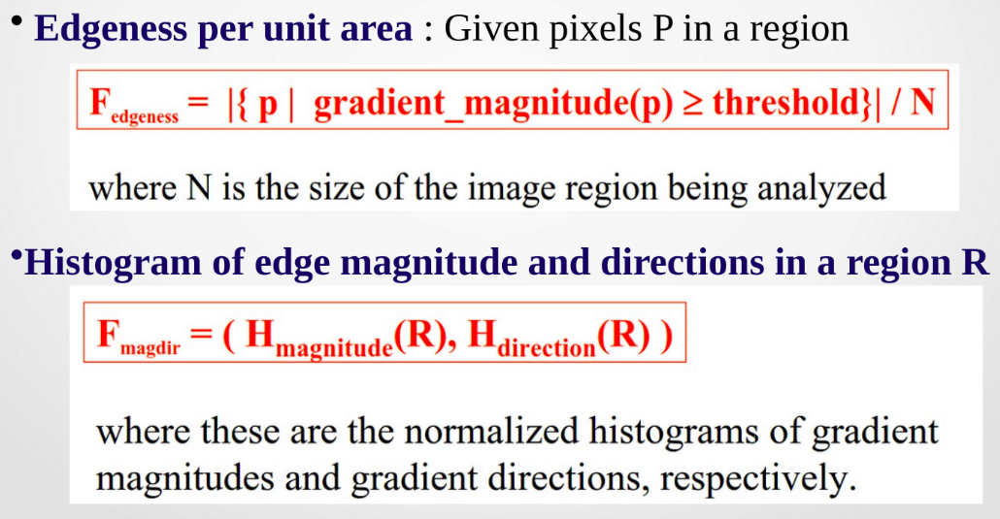

### Local Binary Pattern (LBP)

- Replace each pixel with a n-bit binary number representing the values surrounding that pixel.
  - For an 8-bit number, replace each pixel with a number describing the 8 surrounding pixels.
  - 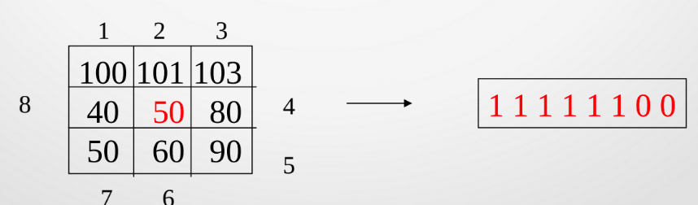
- Represent the texture in the image by a **histogram of LBP values**.

### Gray Level Co-occurence Matrix (GLCM)
- Construct a matrix that represents spatial relationship between values of region.
  - Generate matrix C_d(i,j) that indicates how many times a value i co-occurs with value j in relationship d.
  - 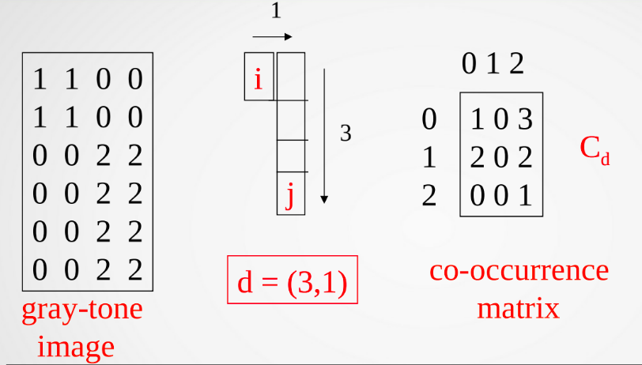
  - Compute the **normalized co-occurence matrix**, dividing each value by the sum of the values in the matrix

- Extract values from that matrix to represent the texture.
  - **Energy (Uniformity)**
    - 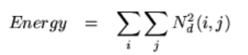
    - Measures **uniformity**
    - Maximum when image is constant
  - **Entropy**
    - 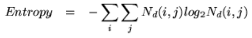
    - Measures **randomness**
    - Maximum when elements in image are equal
    - Equals 0 when all elements are different
    - Entropy is large when image is not textually uniform
  - **Contrast**
    - 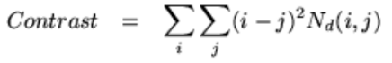
    - Measures **intensity contrast between pixels and their neighbours**
    - Maximum when pixel intensity and its neighbour are very different
    - Equals 0 when image is constant
  - **Homogeneity**
    - 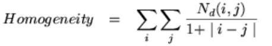
    - Measures **spatial closeness of the distribution**
    - Maximum (= 1) when distribution is only on diagonal
    - Equals 0 when distribution is uniform

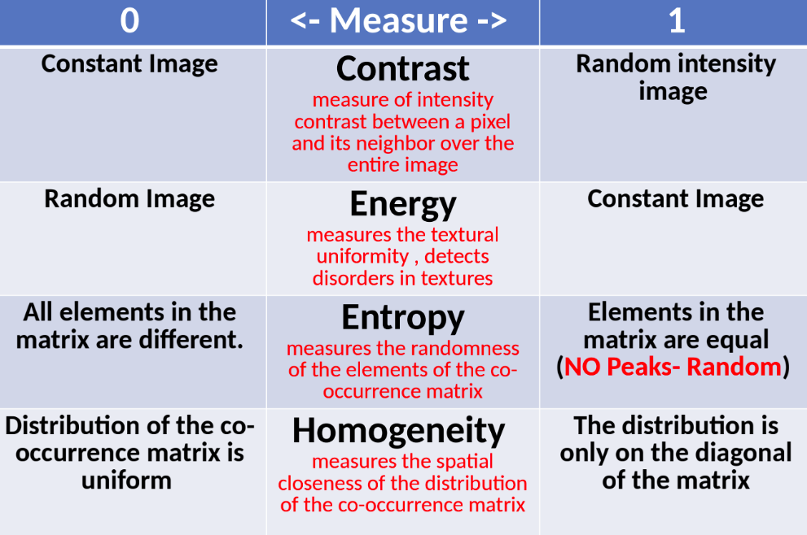

### Windowing

- Texture Analysis algorithms are applied to an image through a window of size w centered around a certain pixel
- The value of the resulting statistical measure is assigned to that pixel

### Law's Texture Energy Features

- They are filters applied to images 
- Each filter takes a certain shape and patterns (spots, bars, ...)

#### The Law's Algorithm
- Filter image using texture filter
- Compute texture energy by summing absolute value of filtered image in local neighbourhoods around each pixel
- Combine features to achieve rotational invariance

#### 1-D Law's filters

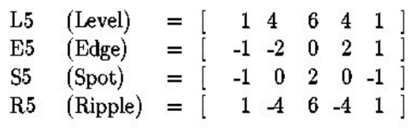

- L5 (Gaussian): center weighted average
- E5 (Gradient): edges
- S5 (LOG): spots
- R5 (Gabor): ripples

#### 2-D Law's filters

- Can combine **1-D law's filters** to generate more complex 2-D filters.
- Used for spotting a certain pattern.
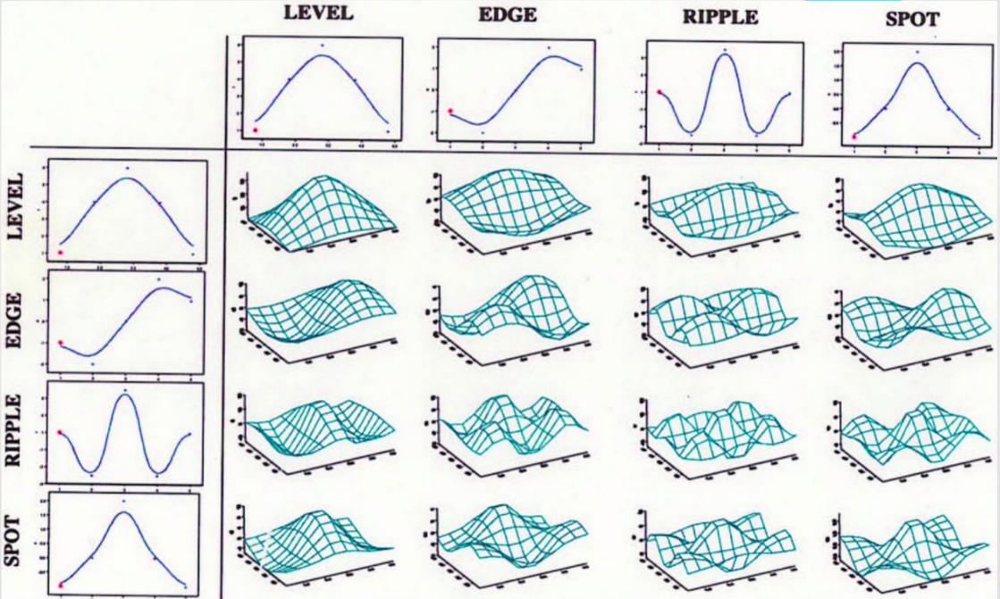

#### 9-D Pixel Feature Vector
Using the 2-D Law's filters we can generate a 9-D feature vector for each pixel.
The algorithm is as follows:
1. Subtract mean neighbourhood from center pixel *to remove effect of illumination*.
2. Apply 16 5x5 masks to get 16 filtered images.
3. Produce 16 texture energy maps using 15x15 windows.
    - Each pixel is replaced by the average of the 15x15 window around it.
4. Replace each distinct pixel with its average map.
    - After producing 16 energy maps for each pixel, some pairs are combined in a way (replace each pair with its average) to produce 9 maps for each pixel.
    - 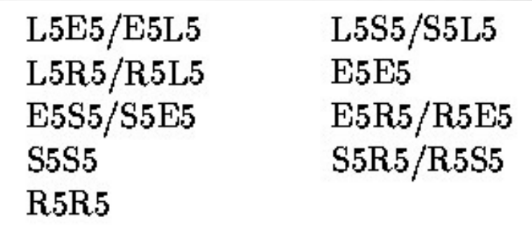

#### Law's process visualized

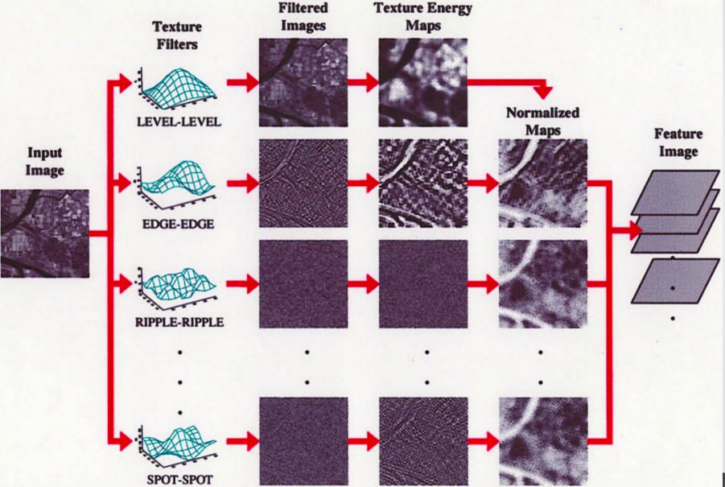