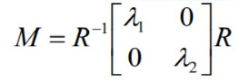

# CMP362 - Image Processing and Computer Vision

This is a quick summary for the image processing course, containing important notes and explanations for important parts

- [CMP362 - Image Processing and Computer Vision](#cmp362---image-processing-and-computer-vision)
- [Texture Analysis](#texture-analysis)
  - [What is a texture?](#what-is-a-texture)
  - [Texture Analysis Approaches](#texture-analysis-approaches)
  - [Structural Approach](#structural-approach)
  - [Statistical Approach](#statistical-approach)
    - [Edge Density and Direction](#edge-density-and-direction)
    - [Local Binary Pattern (LBP)](#local-binary-pattern-lbp)
    - [Gray Level Co-occurence Matrix (GLCM)](#gray-level-co-occurence-matrix-glcm)
    - [Windowing](#windowing)
    - [Law's Texture Energy Features](#laws-texture-energy-features)
      - [The Law's Algorithm](#the-laws-algorithm)
      - [1-D Law's filters](#1-d-laws-filters)
      - [2-D Law's filters](#2-d-laws-filters)
      - [9-D Pixel Feature Vector](#9-d-pixel-feature-vector)
      - [Law's process visualized](#laws-process-visualized)
- [Harris Corner Detector](#harris-corner-detector)
  - [How to detect corners?](#how-to-detect-corners)
  - [Mathematics behind corner detection](#mathematics-behind-corner-detection)
  - [Corner detection algorithm](#corner-detection-algorithm)
  - [Finding corner response without eigenvalues](#finding-corner-response-without-eigenvalues)
  - [Harris Corner algorithm](#harris-corner-algorithm)
  - [Harris Corner properties](#harris-corner-properties)
- [Blob detection](#blob-detection)
  - [Laplacian of Gaussian (LOG)](#laplacian-of-gaussian-log)
  - [Difference of Gaussians (DOG)](#difference-of-gaussians-dog)
# Texture Analysis

## What is a texture?
- Texture is a repeating pattern in images.
- Gives us information about spatial relationship between colors or intensities.
- Cannot be defined for a point.
- Texture consists of **texture primitives** called **texels**.
  - **Tone** is based on the pixel intensity in the texel.
  - **Structure** represents the spatial relationship between texels.

## Texture Analysis Approaches
1. Structural Approach
     - Repeating pattern in image.
2. Statistical Approach
     - Quantitative measure of the arrangement of intensities in region.

## Structural Approach
- Set of elements occuring in a repeating pattern.
  
- Extracting those patterns from real images is difficult or impossible.
  

## Statistical Approach
- Numeric quantities that describe textures and can be computed from gray tones or colors alone.
- Less intuitive but **computationally efficient**.
- Can be used for **classification** or **segmentation**.

Some statistical approaches are
1. Edge density and direction
2. Local Binary Pattern (LBP)
3. Gray Level Co-occurrence Matrix (GLCM)
4. Law's Texture Energy Features

### Edge Density and Direction
- Compute the **number of edge pixels**, and **the direction of edges** in a region.
- **High edge density = busy region**.
- Edgeness per unit area
  - Measures busyness of region.
- Histogram of edge magnitude and direction
  - Measures busyness and orientation of edges.

### Local Binary Pattern (LBP)😂

- Replace each pixel with a n-bit binary number representing the values surrounding that pixel.
  - For an 8-bit number, replace each pixel with a number describing the 8 surrounding pixels.
  - 
- Represent the texture in the image by a **histogram of LBP values**.

### Gray Level Co-occurence Matrix (GLCM)
- Construct a matrix that represents spatial relationship between values of region.
  - Generate matrix C_d(i,j) that indicates how many times a value i co-occurs with value j in relationship d.
  - 
  - Compute the **normalized co-occurence matrix**, dividing each value by the sum of the values in the matrix

- Extract values from that matrix to represent the texture.
  - **Energy (Uniformity)**
    - 
    - Measures **uniformity**
    - Maximum when image is constant
  - **Entropy**
    - 
    - Measures **randomness**
    - Maximum when elements in image are equal
    - Equals 0 when all elements are different
    - Entropy is large when image is not textually uniform
  - **Contrast**
    - 
    - Measures **intensity contrast between pixels and their neighbours**
    - Maximum when pixel intensity and its neighbour are very different
    - Equals 0 when image is constant
  - **Homogeneity**
    - 
    - Measures **spatial closeness of the distribution**
    - Maximum (= 1) when distribution is only on diagonal
    - Equals 0 when distribution is uniform

### Windowing

- Texture Analysis algorithms are applied to an image through a window of size w centered around a certain pixel
- The value of the resulting statistical measure is assigned to that pixel

### Law's Texture Energy Features

- They are filters applied to images 
- Each filter takes a certain shape and patterns (spots, bars, ...)

#### The Law's Algorithm
- Filter image using texture filter
- Compute texture energy by summing absolute value of filtered image in local neighbourhoods around each pixel
- Combine features to achieve rotational invariance

#### 1-D Law's filters

- L5 (Gaussian): center weighted average
- E5 (Gradient): edges
- S5 (LOG): spots
- R5 (Gabor): ripples

#### 2-D Law's filters

- Can combine **1-D law's filters** to generate more complex 2-D filters.
- Used for spotting a certain pattern.

#### 9-D Pixel Feature Vector
Using the 2-D Law's filters we can generate a 9-D feature vector for each pixel.
The algorithm is as follows:
1. Subtract mean neighbourhood from center pixel *to remove effect of illumination*.
2. Apply 16 5x5 masks to get 16 filtered images.
3. Produce 16 texture energy maps using 15x15 windows.
    - Each pixel is replaced by the average of the 15x15 window around it.
4. Replace each distinct pixel with its average map.
    - After producing 16 energy maps for each pixel, some pairs are combined in a way (replace each pair with its average) to produce 9 maps for each pixel.
    - 

#### Law's process visualized

# Harris Corner Detector

In image matching, we need an invariant feature, needs to be **insensitive** to
  - translation
  - rotation
  - scaling
  - brightness changes

Corners are good features for matching, this is because a corner has changes in all directions (a shift in any direction will result in a significant change at a corner).

## How to detect corners?

What defines a corner is that a shift in any direction will result in a change, so to detect corners we can

1. Shift in horizontal, vertical, and diagonal directions by one pixel
2. Calculate the absolute value of the mean shift error (MSE) for each shift
3. Take the **minimum** MSE as the cornerness response

*Note: we pick the minimum MSE because in a corner, the minimum value will still be high, but in an edge or a flat region the minimum value will be very small.*

## Mathematics behind corner detection

By simplification of the equation above with taylor series we can reach this final form

*M: Auto-correlation matrix*

Since M is symmetric, we can decompose it into

This matrix can also be visualized as an ellipse with 
- Axis length determined by **eigenvalues** 
- Axis orientation determined by **eigenvectors** (R)

Using this visualization we can visualize different regions as ellipses

Therefore
- 2 strong eigenvalues: interest point
- 1 strong eigenvalue: contour
- 0 strong eigenvalues: uniform region

we can threshold on the eigenvalues to find interest points.

## Corner detection algorithm

1. Compute gradient at each point (Ix, Iy)
2. Create auto-correlation matrix (M) using gradients
3. Compute the eigenvalues
4. Threshold on eigenvalues

## Finding corner response without eigenvalues
Corner response can also be computed by the determinant and trace of matrix M

- Corner response (R) is 
  - Positive for corners
  - Negative for edges
  - Small for flat regions

## Harris Corner algorithm

1. Compute gradients for image (Ix, Iy)
2. Create auto-correlation matrix (M) using gradients
3. Compute the the response R for each pixel
4. Threshold on value of R
5. Do non-maxima supression to get single response for each corner

## Harris Corner properties

- Rotation invariance
  - Ellipse (corner) rotates but its shape remains the same
- **Not** invariant to scaling

# Blob detection

Blobs are considered interest points for detection.

## Laplacian of Gaussian (LOG)

LOG is used for blob detection, because for a certain sigma, LOG can detect blobs with certain sizes.

The response with the maximum value is considered a blob corresponding to that sigma value.

We can compute LOG at different sigmas to detect blobs of different sizes

## Difference of Gaussians (DOG)

DOG is used as an approximation for LOG because it is a much faster approach,
the idea is calculating gaussians at different sigmas, and then subtracting each image from the one before it to get the response we want.

# Scale Invariant Feature Transform (SIFT)

We want a feature descriptor that is invariant to
  - Scale
  - Rotation
  - Illumination change

## Algorithm steps
1. **Construct a scale space**
     - Take the original image and generate progressively blurred out images by using **Gaussian Blur**, multiplying the value of sigma each time by k. $\sigma → k*\sigma → k^2*\sigma$
      - 
     - SIFT also resizes original image to half size and then generated blurred images again. and keep repeating.
      - 
2. **LOG approximation**
    - Compute differences between each blurred image per octave to find DOG (approximation for LOG)
    - 
3. **Finding key points**
    - Iterate through all pixels in all scales that is between two scales and check its neighbourhood within the current scale image, the scale image above it and the scale image below it. 
    - A point is marked as an interest point if it is the greatest or the least of all 26 neighbours.
    - 
4. **Eliminate edges and low contrast regions**
    - Reject points with bad contrast: DoG smaller than 0.03 (values are between [0,1]).
    - Reject edges.
5. **Assign orientation to the key points**
    - Collect gradient magnitude and direction around key point to figure out the dominant orientation.
    - This orientation provides rotation invariance
    - Steps are as follows:
      1. For each point X, define a window that surrounds this point. The dimension of window is variable (depends on scale).
        - 
      2. For each pixel in this window calculate the gradient magnitude and orientation.
      3. Create a histogram of orientations with 36 bins.
        - 
      4. The peak of the histogram is assigned to the orientation of the key point, also any points above 80% is converted to a new keypoint with same position and magnitude, but different orientation.

      - *Note that orientation can split a keypoint into multiple keypoints.*

6. Generate SIFT features
    - So far, each point has:
      - Location: (x, y)
      - Scale: $\sigma$
      - Gradient magnitude and orientation: m, $\theta$

    1. Rotate patches around their dominant gradient orientation.
        - 
    2. Take 16x16 window around the keypoint, which is broken to sixteen 4x4 windows.
        - 
    3. Calculate gradient magnitudes and orientations within each 4x4 window.
    4. Put these orientations in an 8 bins histogram. (the amount added to the histogram depends on the **magnitude of the gradient** and on the **distance from the keypoint**)
        - 
    5. Do this for all sixteen 4x4 regions, end up with 4x4x8 = 128 numbers.
    6. Normalize the 128 numbers. These numbers form the 128 features (feature vector). The keypoint is uniquely identified by this feature vector.

Wrap up of SIFT features:
- Descriptor 128-D:
  - 4x4 patches, each with 8-D gradient angle histogram, 4x4x8 = 128.
  - Normalized to reduce effect of illumination change.
- Position (x,y):
  - Where the feature is at.
- Scale:
  - Control region size for descriptor extraction.
- Orientation
  - To achieve rotation invariant descriptor.
